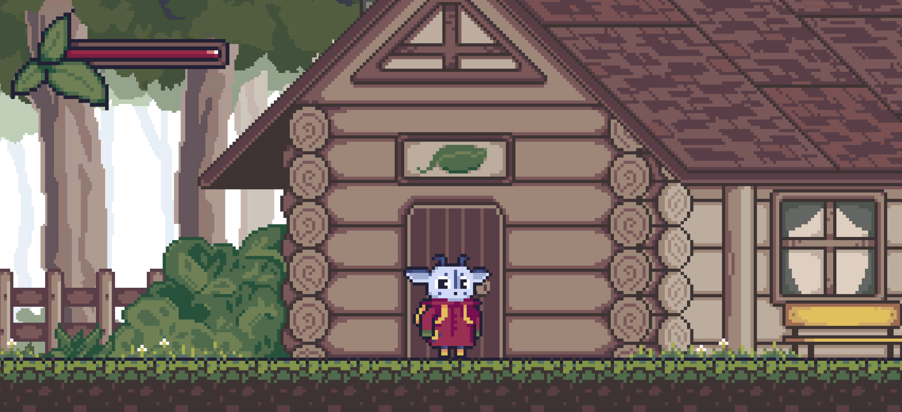

# Косулик

> 2D-платформер із квестовою системою, діалогами та алхімією



---

## 📖 Опис

«Kosulyk» — це навчально-розважальна 2D-гра, у якій головний герой вирушає в містичний ліс, щоб зібрати цілющі рослини й врятувати свою бабусю. 
Поєднання платформера й ролевих елементів дарує гравцю:

- **Глибоку систему квестів** з лінійною залежністю: без створення першого еліксиру не відкриється наступний рецепт.  
- **Алхімічний крафтинг**: створюйте ліки за формулами й відкривайте приховані рецепти.  
- **Занурення в історію**: досліджуйте локації та розмовляйте з мешканцями лісу.


---

## 🚀 Фічі

- **Quest System** на базі ScriptableObject  
- **State Machine** для гравця з розширюваними станами  
- **Event-Driven** архітектура для квестів, UI та інпутів  
- **Збереження прогресу** в JSON/PlayerPrefs  
- **UML-діаграми** в папці `Docs/Diagrams`

---

## ⚙️ Вимоги

- **Unity** 2021.3.20f1 
- **.NET** 4.x  
- Git   

---

## 💾 Інструкція з встановлення

1. **Клонувати репозиторій**  
   ```bash
   git clone https://github.com/anastasiia-tykholiz/KosulykGame
   cd KosulykGame
	````

## ▶️ Як грати

- **W/A/S/D** або стрілки — рух
- **Space** — стрибок
- **E** — взаємодія з NPC/об’єктами

- наявна також підтримка контролерів


## 🌐 Майбутні плани

- **Повна локалізація**: англійська, українська
- **Math Lab**: окрема зона для освоєння формул і створення унікальних еліксирів
- **Інтеграція музики та звуків**: для створення атмосфери

